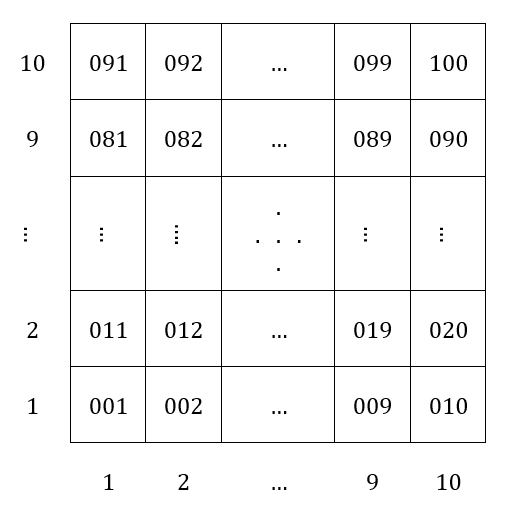

# Actions
1. Turn left
2. Turn right
3. Turn up
4. Turn down
5. Move forward
    - Sau khi tiến tới, ô phía sau được explored.
    - Trừ 10 điểm.
6. Pick up Gold
    - Cộng 100 điểm.
7. Perceive Breeze
8. Perceive Stench
9. Shoot an Arrow
    - Trừ 100 điểm.
10. Kill Wumpus
    - Ô chứa Wumpus bị bắn chính là ô phía trước mặt của Agent, ô này được explored.
    - Bỏ các Stench xung quanh của ô chứa Wumpus này.
11. Be eaten by Wumpus
    - Trừ 10000 điểm.
    - Set state thành Gameover.
    - Hiện màn hình Gameover.
12. Fall into Pit
    - Trừ 10000 điểm.
    - Set state thành Gameover.
    - Hiện màn hình Gameover.
13. Kill all Wumpus and Grab all Gold
    - Set state thành Victory.
14. Climb out of the cave.
    - Cộng 10 điểm.
    - Nếu state hiện tại là:
        - Victory: hiện màn hình Victory.
        - TryYourBest: hiện màn hình TryYourBest.

Lưu ý: state mặc định là TryYourBest (tức thoát được hang nhưng chưa giết hết Wumpus và chưa nhặt hết Gold).

# Tọa độ của Map

# Algorithms
## Literal
Về ý tưởng, để biểu diễn ô thứ 99 không có Breeze, ta có thể viết thành `-B099`. Tương tự, ô thứ 2 có Wumpus sẽ được biểu diễn thành `W002`.

Tuy nhiên, để biểu diễn mỗi literal như trên đơn giản hơn, ta sẽ quy về dạng số thay vì chuỗi. Quy ước rằng:
- 1 là Pit
- 2 là Wumpus
- 3 là Breeze
- 4 là Stench
- dấu trừ tương đương với operator NOT
- 3 số cuối cùng của literal và tọa độ của ô đang xét

Vậy, ô thứ 99 không có Breeze sẽ là `-3099` và ô thứ 2 có Wumpus sẽ là `2002`.

## Clause
1 Clause gồm nhiều Literal hợp lại. Ta dùng cấu trúc dữ liệu List để thể hiện.

Ví dụ: `[-1002, 2002, -3003]` tương ứng với `-1002 OR 2002 OR -3003`, tương ứng với `không có Pit ở ô 2 HOẶC không có Wumpus ở ô 2 HOẶC không có Breeze ở ô 3`.

## Knowledge Base (KB)
KB gồm nhiều Clause giao lại (CNF). Ta dùng cấu trúc dữ liệu List để thể hiện.

Ví dụ: `[[-1002, 2002, -3003], [1010], [-3001, 4001]]` tương ứng với `(-1002 OR 2002 OR -3003) AND (1010) AND (-3001 OR 4001)`.

## Ý tưởng
Khi Agent bước vào 1 ô, Agent sẽ thực hiện các bước sau:

1. Thêm ô này vào Path.
2. Nếu ô này chưa được explore:
    - Đánh dấu explore.
    - Cập nhật danh sách kề.
    - Nhận thức môi trường tại ô đó để thêm dữ liệu vào KB.
        - Thêm vào KB: Pit?
            - Chết.
            - Kết thúc game.
        - Thêm vào KB: Wumpus?
            - Chết.
            - Kết thúc game.
        - Thêm vào KB: Breeze?
            - Thêm vào KB: các ô xung quanh có thể có Pit (chuyển về CNF).
            - Thêm vào ActionList.
        - Thêm vào KB: Stench?
            - Thêm vào KB: các ô xung quanh có thể có Wumpus (chuyển về CNF).
            - Thêm vào ActionList.
        - Gold?
            - Nhặt Gold.
            - Thêm vào ActionList.
3. 